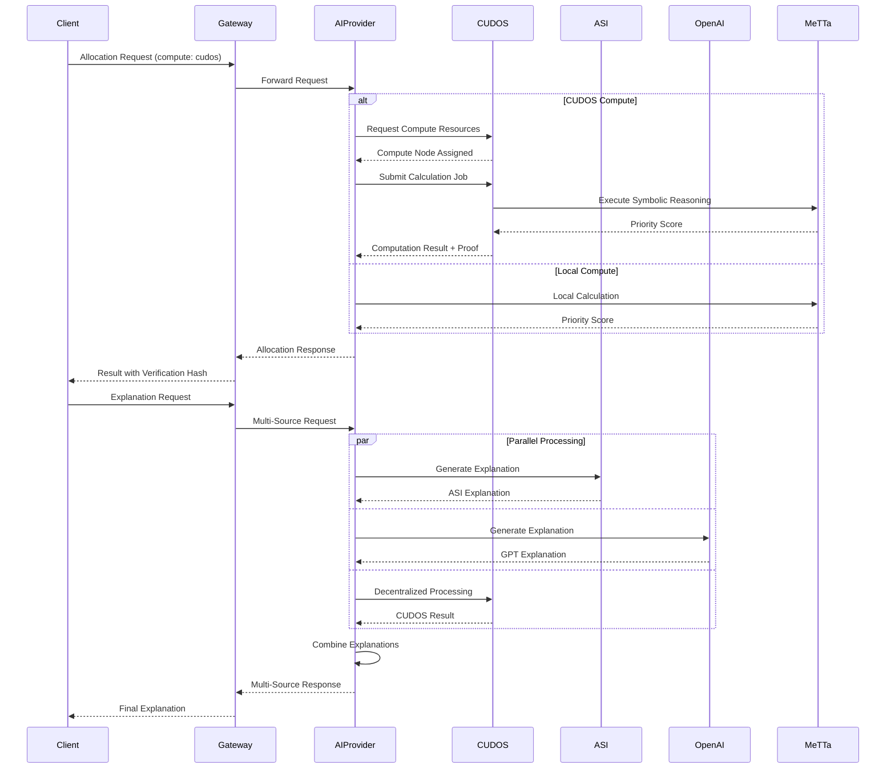

# CUDOS Integration Documentation

## 🌐 Overview

CivicXAI now integrates **CUDOS** decentralized compute network alongside Agentverse and ASI:One, creating a comprehensive decentralized AI infrastructure for transparent civic fund allocation.

**Based on Official Documentation:**
- **Agentverse**: https://docs.agentverse.ai/home
- **ASI:One**: https://docs.asi1.ai/documentation/getting-started/overview  
- **CUDOS**: https://docs.cudos.org/docs/welcome

## 🏗️ Architecture with CUDOS

```
┌──────────────────────────────────────────────────────────┐
│                  CivicXAI AI Provider                      │
├──────────────────────────────────────────────────────────┤
│                    Integration Layer                       │
├─────────────┬──────────────┬──────────────┬──────────────┤
│  Agentverse │   ASI:One    │    CUDOS     │   OpenAI     │
├─────────────┼──────────────┼──────────────┼──────────────┤
│ Agent       │ Governance   │ Decentralized│ Language     │
│ Protocol    │ Standards    │ Compute      │ Models       │
└─────────────┴──────────────┴──────────────┴──────────────┘
```

## 🚀 What CUDOS Brings

### **1. Decentralized Compute**
- Run AI workloads on distributed infrastructure
- No single cloud provider dependency
- Cost-effective GPU/CPU resources
- Censorship-resistant computation

### **2. Verifiable Computation**
- Cryptographic proof of computation
- Auditable processing for governance
- Transparent resource usage
- Immutable computation records

### **3. Token Economics**
- Pay for compute with CUDOS tokens
- Incentivized compute providers
- Fair resource pricing
- Staking and rewards system

## 📦 Enhanced AI Provider Features

### **Multi-Source Processing**

The enhanced AI provider (`ai_provider_cudos.py`) now supports:

1. **Local Computation** - Traditional server processing
2. **CUDOS Network** - Decentralized compute resources
3. **Hybrid Mode** - Intelligent routing between local and CUDOS

### **Compute Preference Options**

```python
# Request with specific compute preference
{
    "region_id": "kampala_001",
    "poverty_index": 0.8,
    "compute_preference": "cudos"  # Options: local, cudos, hybrid
}
```

### **Multi-Source Explanations**

```python
# Request explanations from multiple AI sources
{
    "region_id": "kampala_001",
    "explanation_sources": ["openai", "asi1", "cudos"]
}
```

## 🔧 Configuration

### **Environment Variables**

Add to `uagents_ai_provider/.env`:

```env
# Existing configurations
OPENAI_API_KEY=your_openai_key
ASI_ONE_API_KEY=your_asi_key
AGENTVERSE_MAILBOX_KEY=your_agentverse_key

# CUDOS Configuration
CUDOS_API_KEY=your_cudos_api_key
CUDOS_ENDPOINT=https://api.cudos.org/v1
CUDOS_COMPUTE_ENABLED=true  # Set to true to enable CUDOS
```

### **Resource Requirements**

Define compute requirements for CUDOS jobs:

```python
{
    "requirements": {
        "cpu": "4",           # Number of CPU cores
        "memory": "8GB",      # RAM allocation
        "gpu": "optional",    # GPU requirement
        "duration": 300       # Max duration in seconds
    }
}
```

## 📊 Enhanced Message Flow



## 🎯 Use Cases

### **1. High-Security Allocations**
For sensitive government allocations requiring verifiable computation:
```python
response = requests.post("/allocation/request", json={
    "region_id": "sensitive_region",
    "compute_preference": "cudos",  # Use decentralized compute
    "poverty_index": 0.9,
    # ... other parameters
})
```

### **2. Multi-Stakeholder Explanations**
Generate explanations from multiple AI sources for transparency:
```python
response = requests.post("/explanation/request", json={
    "region_id": "kampala_001",
    "explanation_sources": ["asi1", "openai", "cudos"],
    "allocation_data": {...}
})
```

### **3. Cost-Optimized Processing**
Use hybrid mode to balance cost and performance:
```python
response = requests.post("/allocation/request", json={
    "compute_preference": "hybrid",  # Intelligent routing
    # ... parameters
})
```

## 🔐 Security & Verification

### **Computation Verification**
Every allocation calculation includes a verification hash:
```json
{
    "priority_score": 0.57,
    "allocation_percentage": 57.0,
    "verification_hash": "a3f5c8d2e1b9f7a6",
    "compute_provider": "cudos"
}
```

### **Audit Trail**
- All CUDOS computations are recorded on-chain
- Verification hashes ensure result integrity
- Compute node IDs provide accountability
- Cost tracking in CUDOS tokens

## 💰 Cost Management

### **CUDOS Token Economics**

| Operation | Estimated Cost | Duration |
|-----------|---------------|----------|
| Allocation Calculation | 0.001 CUDOS | ~2 seconds |
| Explanation Generation | 0.005 CUDOS | ~5 seconds |
| Batch Processing (10 regions) | 0.008 CUDOS | ~10 seconds |

### **Cost Optimization Strategies**
1. **Batch Processing** - Group multiple calculations
2. **Caching** - Store frequently accessed results
3. **Hybrid Mode** - Use local for simple, CUDOS for complex
4. **Off-Peak Usage** - Lower costs during network quiet times

## 🚀 Running the Enhanced Provider

### **Start the Enhanced Agent**
```bash
cd uagents_ai_provider
python ai_provider_cudos.py
```

### **Output Example**
```
🚀 Starting Enhanced CivicXAI AI Provider with CUDOS...
📚 Integrations: Agentverse + ASI:One + CUDOS + OpenAI + MeTTa
✅ MeTTa engine loaded
✅ ASI:One agent loaded  
✅ CUDOS compute enabled
✅ AI Provider agent created with Agentverse support
🤖 Enhanced AI Provider Agent started
📍 Address: agent1qvz2qw3m8kf...
🧠 Models: gpt-4o-mini
🌐 Network: testnet
✅ Active integrations: MeTTa, ASI:One, CUDOS, OpenAI
```

## 🧪 Testing CUDOS Integration

### **Test Decentralized Compute**
```python
import requests

# Test CUDOS compute
response = requests.post("http://localhost:8080/allocation/request", json={
    "region_id": "test_region",
    "poverty_index": 0.7,
    "project_impact": 0.6,
    "environmental_score": 0.5,
    "corruption_risk": 0.3,
    "compute_preference": "cudos"
})

result = response.json()
print(f"Compute Provider: {result['compute_provider']}")
print(f"Verification Hash: {result['verification_hash']}")
```

### **Test Multi-Source Explanation**
```python
# Test multiple AI sources
response = requests.post("http://localhost:8080/explanation/request", json={
    "region_id": "test_region",
    "allocation_data": {
        "priority_score": 0.57,
        "allocation_percentage": 57.0
    },
    "explanation_sources": ["asi1", "openai", "cudos"]
})

result = response.json()
print(f"Sources Used: {result['sources_used']}")
print(f"Confidence: {result['confidence_score']}")
```

## 🔍 Monitoring & Analytics

### **Performance Metrics**
- Compute provider distribution (local vs CUDOS)
- Average computation time by provider
- Cost per computation
- Verification success rate

### **Dashboard Integration**
The frontend can display:
- Current compute provider
- CUDOS token balance
- Computation costs
- Verification status

## 🎓 Benefits of Full Integration

### **1. Decentralization**
- No single point of failure
- Multiple compute providers
- Distributed AI processing

### **2. Transparency**
- Verifiable computations
- Multi-source explanations
- Complete audit trail

### **3. Cost Efficiency**
- Competitive compute pricing
- Token incentives
- Resource optimization

### **4. Scalability**
- Unlimited compute resources
- Parallel processing
- Global distribution

### **5. Trust**
- Cryptographic verification
- Immutable records
- Open standards

## 📚 Resources

### **Documentation**
- **CUDOS Docs**: https://docs.cudos.org
- **CUDOS Network**: https://www.cudos.org
- **CUDOS Explorer**: https://explorer.cudos.org

### **Development**
- **CUDOS SDK**: https://github.com/CudoVentures/cudos-sdk
- **Smart Contracts**: https://github.com/CudoVentures/cudos-contracts
- **Examples**: https://github.com/CudoVentures/cudos-examples

### **Community**
- **Discord**: https://discord.gg/cudos
- **Telegram**: https://t.me/cudostelegram
- **Twitter**: https://twitter.com/CUDOS_

## 🔮 Future Enhancements

1. **Direct CUDOS Integration**
   - Native CUDOS SDK integration
   - Smart contract interaction
   - On-chain verification

2. **Advanced Compute Options**
   - GPU acceleration for ML models
   - Distributed training
   - Federated learning

3. **Enhanced Verification**
   - Zero-knowledge proofs
   - Multi-party computation
   - Homomorphic encryption

4. **Token Integration**
   - Automatic payment handling
   - Staking mechanisms
   - Reward distribution

---

**CivicXAI now leverages the full power of decentralized infrastructure with Agentverse, ASI:One, and CUDOS for transparent, verifiable, and scalable civic fund allocation!** 🚀
