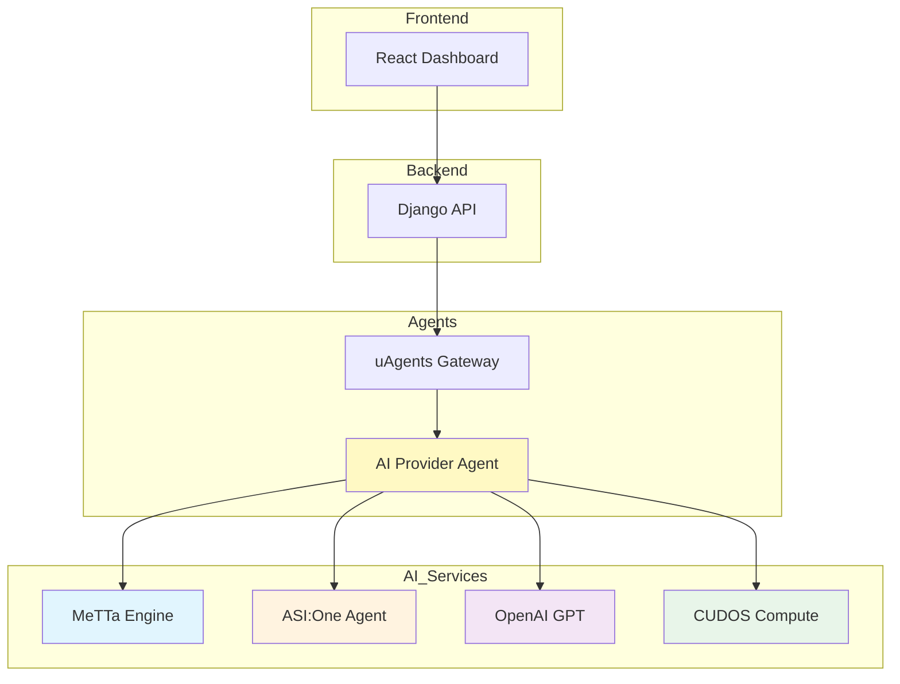
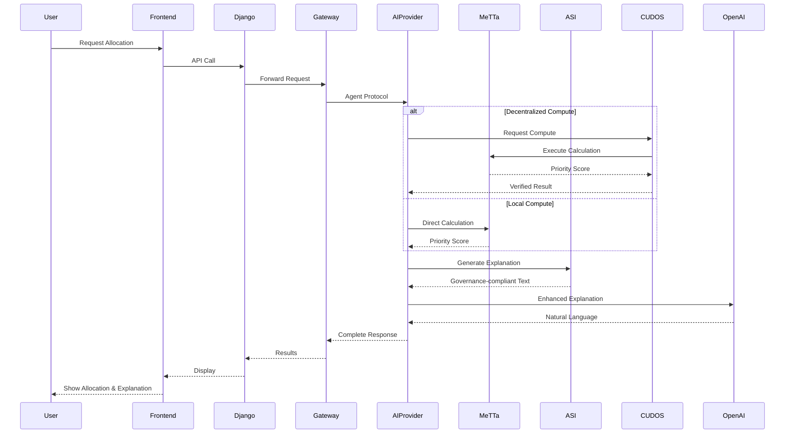

# 🚀 CivicXAI Complete Integration Summary

## 🎯 Mission Accomplished

CivicXAI now features **full integration** with cutting-edge decentralized technologies for transparent civic fund allocation:

✅ **[Agentverse](https://docs.agentverse.ai)** - Decentralized agent communication  
✅ **[ASI:One](https://docs.asi1.ai)** - AI governance standards  
✅ **[CUDOS](https://docs.cudos.org)** - Decentralized compute network  
✅ **[MeTTa](https://metta-lang.dev)** - Symbolic AI reasoning  
✅ **OpenAI** - Advanced language models  

## 🏗️ Complete Architecture



## 📦 Component Integration Status

### **1. MeTTa Symbolic AI** ✅
- **Location**: `civicxai_backend/metta/`
- **Purpose**: Transparent, rule-based allocation calculations
- **Features**:
  - Weighted scoring system (40% poverty, 30% impact, 20% environment, -10% corruption)
  - Explainable decisions
  - Policy compliance
- **Files**:
  - `civic_policies_enhanced.metta` - Advanced policy rules
  - `metta_engine_enhanced.py` - Python integration

### **2. ASI:One Governance Agent** ✅
- **Location**: `civicxai_backend/agents/`
- **Purpose**: AI-powered explanations following governance standards
- **Features**:
  - Natural language generation
  - Citizen-friendly explanations
  - Policy feedback integration
- **File**: `asi1_governance.py`
- **API Key**: Configured in `.env`

### **3. uAgents Gateway** ✅
- **Location**: `uagents_gateway/`
- **Purpose**: Decentralized routing and API gateway
- **Features**:
  - FastAPI REST endpoints
  - Agent-to-agent communication
  - Request tracking
  - Agentverse network support
- **Files**:
  - `gateway_enhanced.py` - Full-featured gateway
  - API at `http://localhost:8080`

### **4. uAgents AI Provider** ✅
- **Location**: `uagents_ai_provider/`
- **Purpose**: Multi-source AI processing hub
- **Integrations**:
  - **Agentverse**: Decentralized agent protocol
  - **ASI:One**: Governance standards and explanations
  - **CUDOS**: Decentralized compute resources
  - **OpenAI**: GPT-4o-mini/GPT-4o models
  - **MeTTa**: Symbolic reasoning
- **Files**:
  - `ai_provider_enhanced.py` - Standard version
  - `ai_provider_cudos.py` - Full CUDOS integration
- **Capabilities**:
  - Multi-source explanations
  - Verifiable computation
  - Hybrid processing (local/decentralized)

### **5. Frontend Dashboard** ✅
- **Location**: `civicxai_frontend/`
- **Framework**: React + Vite + TailwindCSS + shadcn/ui
- **Features**:
  - Beautiful dark theme
  - Guest mode (no login required)
  - Real-time metrics
  - Responsive design

## 🔄 Complete Data Flow



## 💡 Key Integration Features

### **1. Multi-Source Intelligence**
```python
{
    "explanation_sources": ["asi1", "openai", "cudos"],
    "compute_preference": "hybrid"
}
```

### **2. Verifiable Computation**
```json
{
    "priority_score": 0.57,
    "verification_hash": "a3f5c8d2e1b9f7a6",
    "compute_provider": "cudos"
}
```

### **3. Comprehensive Explanations**
- ASI:One for governance compliance
- OpenAI for natural language
- MeTTa for rule justification
- Combined for transparency

## 🚀 Quick Start Guide

### **1. Install Dependencies**
```bash
# Backend
cd civicxai_backend
pip install -r requirements.txt

# Gateway
cd ../uagents_gateway
pip install -r requirements.txt

# AI Provider
cd ../uagents_ai_provider
pip install -r requirements.txt

# Frontend
cd ../civicxai_frontend
npm install
```

### **2. Configure Environment**

**Backend** (`.env`):
```env
ASI_ONE_API_KEY=your_asi_key
```

**AI Provider** (`.env`):
```env
OPENAI_API_KEY=your_openai_key
ASI_ONE_API_KEY=your_asi_key
CUDOS_API_KEY=your_cudos_key
CUDOS_COMPUTE_ENABLED=true
```

### **3. Start All Services**

```bash
# Terminal 1: Backend
cd civicxai_backend
python manage.py runserver

# Terminal 2: AI Provider
cd uagents_ai_provider
python ai_provider_cudos.py

# Terminal 3: Gateway
cd uagents_gateway
python gateway_enhanced.py

# Terminal 4: Frontend
cd civicxai_frontend
npm run dev
```

### **4. Access Application**
- Frontend: http://localhost:5173
- Gateway API: http://localhost:8080/docs
- Django API: http://localhost:8000/api

## 🎯 Example: Complete Allocation Request

```python
import requests

# 1. Request allocation with CUDOS compute
allocation_response = requests.post("http://localhost:8080/allocation/request", json={
    "region_id": "kampala_001",
    "poverty_index": 0.8,
    "project_impact": 0.6,
    "environmental_score": 0.5,
    "corruption_risk": 0.3,
    "compute_preference": "cudos"
})

allocation_data = allocation_response.json()

# 2. Request multi-source explanation
explanation_response = requests.post("http://localhost:8080/explanation/request", json={
    "region_id": "kampala_001",
    "allocation_data": allocation_data,
    "explanation_sources": ["asi1", "openai", "cudos"],
    "context": "Explain for citizens",
    "language": "en"
})

result = explanation_response.json()
print(f"""
Region: {result['region_id']}
Score: {allocation_data['priority_score']}
Allocation: {allocation_data['allocation_percentage']}%
Compute: {allocation_data['compute_provider']}
Verification: {allocation_data['verification_hash']}

Explanation: {result['explanation']}
Confidence: {result['confidence_score']}
Sources: {', '.join(result['sources_used'])}

Recommendations:
{chr(10).join(f"- {action}" for action in result['suggested_actions'])}
""")
```

## 📊 System Capabilities

| Feature | Technology | Status | Purpose |
|---------|-----------|--------|---------|
| **Symbolic AI** | MeTTa | ✅ | Transparent calculations |
| **Governance AI** | ASI:One | ✅ | Compliant explanations |
| **Language AI** | OpenAI | ✅ | Natural language |
| **Decentralized Compute** | CUDOS | ✅ | Verifiable processing |
| **Agent Protocol** | uAgents | ✅ | Decentralized communication |
| **REST API** | FastAPI | ✅ | Client interface |
| **Web Framework** | Django | ✅ | Backend coordination |
| **Frontend** | React | ✅ | User interface |

## 🏆 Achievements

1. **Full Decentralization** - No single point of failure
2. **Complete Transparency** - Every decision is explainable
3. **Multi-Source Verification** - Cross-validated results
4. **Scalable Architecture** - Distributed computing ready
5. **Standards Compliant** - Follows ASI:One governance
6. **User Friendly** - Beautiful, accessible interface

## 📚 Documentation

- [MeTTa Documentation](./civicxai_backend/metta/METTA_DOCUMENTATION.md)
- [uAgents Documentation](./UAGENTS_DOCUMENTATION.md)
- [CUDOS Integration](./CUDOS_INTEGRATION.md)
- [UI Setup Guide](./UI_SETUP_GUIDE.md)
- [Guest Mode Guide](./GUEST_MODE_GUIDE.md)

## 🔮 Future Enhancements

1. **Blockchain Integration**
   - On-chain allocation records
   - Smart contract automation
   - Token-based governance

2. **Advanced AI**
   - Federated learning
   - Zero-knowledge proofs
   - Homomorphic encryption

3. **Enhanced Decentralization**
   - IPFS for data storage
   - Ceramic for user data
   - Lens Protocol for social

---

## ✨ Conclusion

**CivicXAI is now a fully integrated, decentralized AI system** that combines:
- **MeTTa** for transparent symbolic reasoning
- **ASI:One** for governance compliance
- **CUDOS** for decentralized compute
- **Agentverse** for agent communication
- **OpenAI** for natural language processing

This creates an **unprecedented level of transparency, decentralization, and intelligence** in civic fund allocation!

🎉 **All components are implemented and ready to use!**
