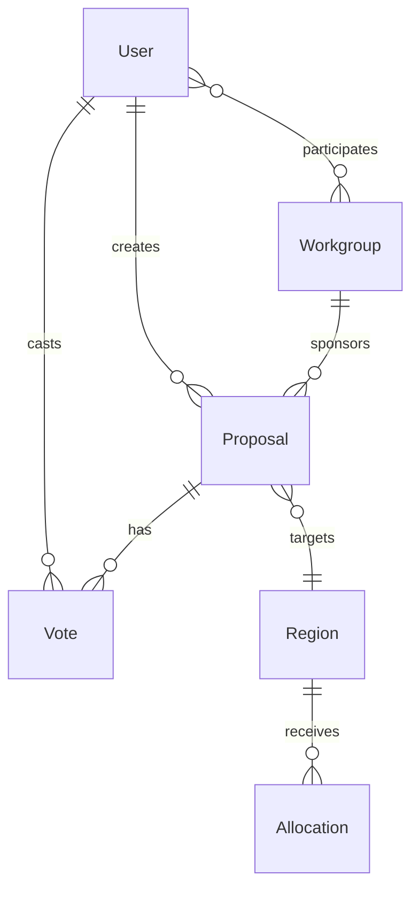

# 🚀 Phase 1 Setup Guide - CivicXAI Governance Platform

## Overview
Phase 1 implementation includes comprehensive Django models, authentication system, and admin interfaces based on the governance dashboard UI.

## ✅ What's Implemented

### 1. **Models** (`explainable_ai/models.py`)
- **User Model** (Extended AbstractUser)
  - Custom fields: role, contribution_score, workgroup associations
  - Roles: citizen, contributor, admin, analyst
- **Region Model**
  - Complete socio-economic and environmental indicators
  - Priority score calculation matching MeTTa logic
- **Allocation Model**
  - Tracks resource distributions with AI explanations
- **Workgroup Model**
  - Governance groups with categories (infrastructure, environment, etc.)
- **Proposal Model**
  - Full proposal lifecycle (draft → review → voting → approved)
- **Vote Model**
  - Democratic voting system
- **Event Model**
  - Calendar system for governance activities
- **DashboardMetrics Model**
  - Aggregated metrics for dashboard display

### 2. **Authentication System**
- JWT-based authentication with refresh tokens
- Custom user registration and login
- Role-based permissions (Admin, Contributor, Citizen)
- Profile management and password change

### 3. **API Endpoints**
- Full REST API with ViewSets for all models
- Authentication endpoints (`/api/auth/...`)
- Dashboard endpoint (`/api/dashboard/`)
- Resource allocation endpoints
- Proposal and voting system

### 4. **Admin Interface**
- Comprehensive Django admin panels for all models
- Custom actions (calculate priorities, approve allocations)
- Visual indicators for status and metrics

## 📦 Installation & Setup

### 1. Install Dependencies
```bash
cd civicxai_backend
pip install -r requirements.txt
```

### 2. Configure Database
```bash
# Delete old database if exists
rm db.sqlite3

# Make migrations for custom User model
python manage.py makemigrations explainable_ai

# Apply all migrations
python manage.py migrate
```

### 3. Create Superuser
```bash
python manage.py createsuperuser
# Follow prompts to create admin account
```

### 4. Load Sample Data
```bash
python manage.py populate_sample_data
```

### 5. Run Development Server
```bash
python manage.py runserver
```

## 🔑 Default Users (After Sample Data)

| Username | Password | Role | Description |
|----------|----------|------|-------------|
| admin | admin123 | Admin | Full system access |
| 0xkenichi | password123 | Contributor | Can create proposals |
| ayomishu | password123 | Contributor | Can vote and contribute |
| citizen1 | password123 | Citizen | View-only access |

## 📍 Key URLs

### Admin Panel
- http://localhost:8000/admin/

### API Endpoints
- **Auth**: http://localhost:8000/api/auth/login/
- **Dashboard**: http://localhost:8000/api/dashboard/
- **Regions**: http://localhost:8000/api/regions/
- **Proposals**: http://localhost:8000/api/proposals/
- **Workgroups**: http://localhost:8000/api/workgroups/

### API Documentation
- http://localhost:8000/api/ (Browsable API)

## 🧪 Testing the System

### 1. Test Authentication
```bash
# Login
curl -X POST http://localhost:8000/api/auth/login/ \
  -H "Content-Type: application/json" \
  -d '{"username": "admin", "password": "admin123"}'

# Use the returned access token for authenticated requests
```

### 2. Test Dashboard
```bash
curl -X GET http://localhost:8000/api/dashboard/ \
  -H "Authorization: Bearer YOUR_ACCESS_TOKEN"
```

### 3. Test Region Priority Calculation
```bash
curl -X POST http://localhost:8000/api/calculate-priority/ \
  -H "Content-Type: application/json" \
  -H "Authorization: Bearer YOUR_ACCESS_TOKEN" \
  -d '{
    "poverty_index": 0.8,
    "project_impact": 0.9,
    "deforestation": 0.4,
    "corruption_risk": 0.3
  }'
```

## 🔄 Workflow Examples

### Creating a Proposal
1. Login as a contributor
2. POST to `/api/proposals/` with proposal data
3. Submit for review: POST to `/api/proposals/{id}/submit_for_review/`
4. Admin changes status to 'voting'
5. Users vote: POST to `/api/proposals/{id}/vote/`
6. Proposal auto-approves when quorum met

### Allocating Resources
1. Admin creates allocation via `/api/allocations/`
2. System calculates priority score
3. AI generates explanation
4. Admin approves: POST to `/api/allocations/{id}/approve/`
5. Finance team disburses: POST to `/api/allocations/{id}/disburse/`

## 🐛 Troubleshooting

### Migration Issues
```bash
# If you get migration conflicts:
python manage.py migrate --run-syncdb
```

### User Model Issues
```bash
# If AUTH_USER_MODEL error:
1. Delete all migration files in explainable_ai/migrations/ except __init__.py
2. Delete db.sqlite3
3. Run makemigrations and migrate again
```

### Sample Data Issues
```bash
# If populate_sample_data fails:
python manage.py shell
>>> from explainable_ai.models import *
>>> User.objects.all().delete()  # Clear existing data
>>> exit()
python manage.py populate_sample_data
```

## 📊 Database Schema



## 🎯 Next Steps (Phase 2)

1. **Frontend Implementation**
   - Build React dashboard matching the UI screenshots
   - Implement authentication flow
   - Create interactive visualizations

2. **Machine Learning Integration**
   - Train allocation prediction model
   - Implement SHAP/LIME explanations
   - Connect to MeTTa engine

3. **Production Deployment**
   - PostgreSQL database setup
   - Environment configuration
   - Docker containerization
   - CI/CD pipeline

## 📝 API Testing with Postman

Import this collection to test all endpoints:

```json
{
  "info": {
    "name": "CivicXAI API",
    "schema": "https://schema.getpostman.com/json/collection/v2.1.0/collection.json"
  },
  "auth": {
    "type": "bearer",
    "bearer": [
      {
        "key": "token",
        "value": "{{access_token}}",
        "type": "string"
      }
    ]
  },
  "variable": [
    {
      "key": "base_url",
      "value": "http://localhost:8000/api"
    }
  ]
}
```

## ✨ Features Ready for Testing

- ✅ User registration and authentication
- ✅ Role-based access control
- ✅ Region priority calculation
- ✅ Resource allocation with AI explanations
- ✅ Proposal creation and voting
- ✅ Workgroup management
- ✅ Event calendar
- ✅ Dashboard metrics
- ✅ Admin panel for all models

## 📞 Support

For issues or questions about Phase 1:
1. Check Django logs: `python manage.py runserver --verbosity 2`
2. Access Django shell: `python manage.py shell`
3. Review admin panel at `/admin/`
4. Check API browser at `/api/`

---

**Phase 1 Complete!** The backend infrastructure is ready. Frontend implementation can now begin using the provided API endpoints.
