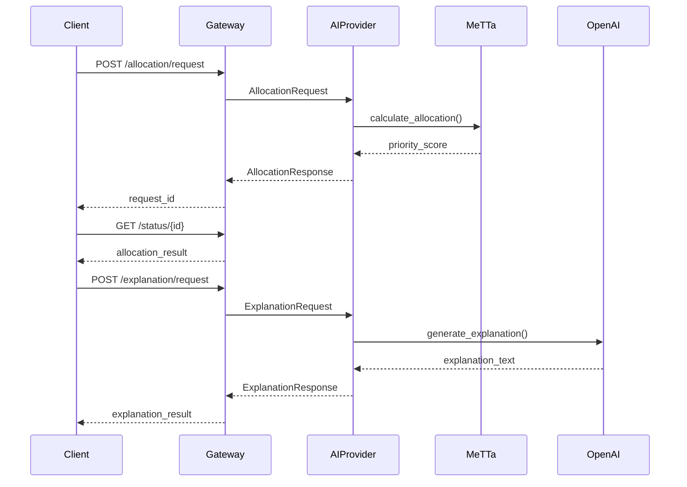

# uAgents Implementation Documentation

## 🌐 Overview

CivicXAI uses the **uAgents Framework** to create decentralized, autonomous agents for transparent civic fund allocation. Based on official documentation from:
- **Agentverse**: https://docs.agentverse.ai/home
- **ASI:One**: https://docs.asi1.ai/documentation/getting-started/overview

## 🏗️ Architecture

```
┌─────────────────────────────────────────────────────────┐
│                     CivicXAI System                      │
├────────────────────┬─────────────────────────────────────┤
│   Gateway Agent    │        AI Provider Agent            │
├────────────────────┼─────────────────────────────────────┤
│ • FastAPI Gateway  │ • OpenAI GPT Integration            │
│ • Request Router   │ • MeTTa Engine (Optional)           │
│ • Agent Protocol   │ • Explanation Generation             │
│ • Agentverse Link  │ • Allocation Calculation            │
└────────────────────┴─────────────────────────────────────┘
```

## 📦 Components

### 1. **uAgents Gateway** (`uagents_gateway/`)

**Purpose**: Decentralized agent communication gateway that routes requests between clients and AI services.

**Key Features**:
- FastAPI REST interface for client applications
- uAgent protocol for decentralized communication
- Request/response tracking and caching
- Agentverse network integration (optional)

**Files**:
- `gateway_enhanced.py` - Enhanced gateway with full features
- `gateway/main.py` - Original basic implementation

**Endpoints**:
```
GET  /                    - Service info
POST /allocation/request  - Request allocation calculation
POST /explanation/request - Request AI explanation
GET  /status/{request_id} - Check request status
GET  /agent/info         - Agent information
GET  /health             - Health check
```

### 2. **uAgents AI Provider** (`uagents_ai_provider/`)

**Purpose**: Intelligent agent that generates explanations using OpenAI GPT models and performs allocation calculations.

**Key Features**:
- OpenAI GPT-4o-mini/GPT-4o integration
- MeTTa symbolic reasoning integration
- Multi-language support
- Confidence scoring
- Action suggestions

**Files**:
- `ai_provider_enhanced.py` - Enhanced provider with MeTTa support
- `main.py` - Original basic implementation

## 🚀 Setup Guide

### Prerequisites

1. **Python 3.8+**
2. **OpenAI API Key** (for AI provider)
3. **Optional**: Agentverse account for network deployment

### Installation

#### Step 1: Install Dependencies

```bash
# Gateway Agent
cd uagents_gateway
pip install -r requirements.txt

# AI Provider Agent
cd ../uagents_ai_provider
pip install -r requirements.txt
```

#### Step 2: Configure Environment

**Gateway Agent** (`uagents_gateway/.env`):
```env
# Agent Configuration
GATEWAY_AGENT_SEED=your_unique_seed_here
GATEWAY_AGENT_PORT=8000
API_PORT=8080

# AI Provider Address (will be shown when provider starts)
AI_PROVIDER_AGENT_ADDRESS=agent1q...

# Optional: Agentverse Integration
AGENTVERSE_MAILBOX_KEY=your_mailbox_key
AGENT_NETWORK=testnet
```

**AI Provider** (`uagents_ai_provider/.env`):
```env
# OpenAI Configuration
OPENAI_API_KEY=your_openai_api_key_here
CHAT_MODEL=gpt-4o-mini

# Agent Configuration
AI_PROVIDER_AGENT_SEED=your_unique_seed_here
AI_PROVIDER_AGENT_PORT=8001

# Optional: Agentverse Integration
AGENTVERSE_MAILBOX_KEY=your_mailbox_key
AGENT_NETWORK=testnet
```

#### Step 3: Run the Agents

**Terminal 1 - AI Provider Agent**:
```bash
cd uagents_ai_provider
python ai_provider_enhanced.py
```

You'll see output like:
```
🤖 AI Provider Agent started
📍 Address: agent1qvz2qw3m8kfqj4f7z9q8x6y5t4r3e2w1q...
🧠 Using model: gpt-4o-mini
```

Copy the agent address and add it to the gateway's `.env` file.

**Terminal 2 - Gateway Agent**:
```bash
cd uagents_gateway
python gateway_enhanced.py
```

## 📡 API Usage

### 1. Request Allocation Calculation

```python
import requests

response = requests.post("http://localhost:8080/allocation/request", json={
    "region_id": "kampala_001",
    "poverty_index": 0.8,
    "project_impact": 0.6,
    "environmental_score": 0.5,
    "corruption_risk": 0.3
})

request_id = response.json()["request_id"]
```

### 2. Request AI Explanation

```python
response = requests.post("http://localhost:8080/explanation/request", json={
    "region_id": "kampala_001",
    "allocation_data": {
        "priority_score": 0.57,
        "allocation_percentage": 57.0,
        "priority_level": "high"
    },
    "context": "Explain why this region received high priority",
    "language": "en"
})

request_id = response.json()["request_id"]
```

### 3. Check Request Status

```python
response = requests.get(f"http://localhost:8080/status/{request_id}")
result = response.json()

if result["status"] == "completed":
    data = result["data"]
    print(f"Result: {data}")
```

## 🌐 Agentverse Integration

### Deploying to Agentverse

1. **Create Account**: Sign up at https://agentverse.ai

2. **Get Mailbox Key**: 
   - Go to your agent dashboard
   - Create a new agent
   - Copy the mailbox key

3. **Configure Agents**:
   Add mailbox key to both `.env` files:
   ```env
   AGENTVERSE_MAILBOX_KEY=your_mailbox_key_here
   AGENT_NETWORK=mainnet  # or testnet
   ```

4. **Deploy**:
   Agents will automatically register with Agentverse on startup

### Benefits of Agentverse

- **Decentralized**: No single point of failure
- **Scalable**: Automatic load balancing
- **Discoverable**: Agents can find each other
- **Secure**: Cryptographic authentication
- **Monetizable**: Charge for agent services

## 🔧 Advanced Configuration

### Custom Protocols

Create custom protocols for specific use cases:

```python
from uagents import Protocol, Model

# Define custom message
class CustomRequest(Model):
    data: str
    priority: int

# Create protocol
custom_protocol = Protocol("CustomProtocol", "1.0.0")

@custom_protocol.on_message(model=CustomRequest)
async def handle_custom(ctx, sender, msg):
    # Handle custom message
    pass
```

### Multi-Agent Systems

Create agent networks for complex workflows:

```python
from uagents import Bureau

# Create multiple agents
gateway = GatewayAgent()
processor = ProcessorAgent()
validator = ValidatorAgent()

# Create bureau to manage them
bureau = Bureau()
bureau.add(gateway.agent)
bureau.add(processor.agent)
bureau.add(validator.agent)

# Run all agents
await bureau.run()
```

### Integration with ASI:One

For ASI:One ecosystem integration:

```python
# Configure ASI endpoint
ASI_ENDPOINT = "https://api.asi1.ai/v1"
ASI_API_KEY = "your_asi_key"

# Use ASI services
from asi_sdk import ASIClient
client = ASIClient(api_key=ASI_API_KEY)
```

## 📊 Message Flow



## 🔒 Security Considerations

1. **API Keys**: Never commit API keys to version control
2. **Agent Seeds**: Use unique, secure seeds for each agent
3. **Rate Limiting**: Implement rate limiting on API endpoints
4. **Authentication**: Add JWT or API key authentication for production
5. **HTTPS**: Use HTTPS in production environments

## 🐛 Troubleshooting

### Common Issues

**Agent Address Not Found**:
- Ensure AI provider is running first
- Copy the correct agent address to gateway config

**OpenAI API Errors**:
- Check API key is valid
- Verify you have credits
- Check rate limits

**Connection Refused**:
- Check ports are not in use
- Verify firewall settings
- Ensure agents are on same network

**MeTTa Not Available**:
- Install hyperon: `pip install hyperon`
- Check Python path includes backend

### Debug Mode

Enable debug logging:

```python
import logging
logging.basicConfig(level=logging.DEBUG)
```

## 📈 Performance Optimization

1. **Caching**: Implement response caching for repeated requests
2. **Batch Processing**: Group multiple requests together
3. **Async Operations**: Use async/await for all I/O operations
4. **Connection Pooling**: Reuse HTTP connections
5. **Model Selection**: Use GPT-4o-mini for cost efficiency

## 🔗 Resources

- **uAgents Documentation**: https://docs.agentverse.ai
- **ASI:One Docs**: https://docs.asi1.ai
- **OpenAI API**: https://platform.openai.com
- **MeTTa Language**: https://metta-lang.dev
- **GitHub Examples**: https://github.com/fetchai/uAgents

## 📝 License

This implementation follows the open-source guidelines of the uAgents framework and ASI:One ecosystem.

---

**Built with ❤️ for transparent civic governance using decentralized AI agents**
